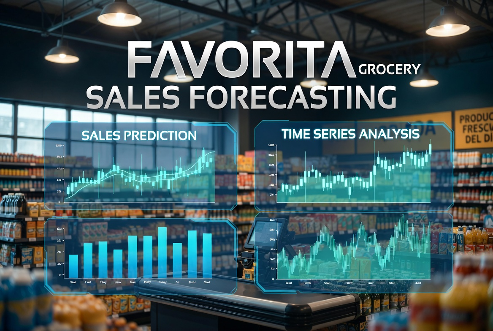

# <center> **PROJECT: Corporación Favorita Grocery Sales Forecasting.**

Large-scale sales forecasting for thousands of products across Favorita grocery stores in Ecuador.

<div align="center">
  
</div>

---

### **Project Goal**

Develop accurate models to forecast daily sales volumes for thousands of products in different stores, helping to optimize inventory and reduce waste.

---

### **Dataset**

- **Corporación Favorita** sales data (Kaggle competition)
- Thousands of products
- Multiple stores with different characteristics
- Rich set of additional features (promotions, oil prices, holidays, etc.)

---

### **Models Implemented & Results**

| Model              | MSE              | RMSE       | MAE         | MAPE     |
|--------------------|------------------|------------|-------------|----------|
| **XGBoost**        | 693,370,731.9    | **2,633.19** | **1,895.83** | **14.16%** |
| CatBoost           | 2,088,904,230.6  | 4,570.45   | 3,121.26    | 22.00%   |

**Best Model**: XGBoost

---

### **Project Stages**

1. Basic data analysis and familiarization
2. Data cleaning and preprocessing
3. Time series analysis (trend, seasonality, stationarity)
4. Feature Engineering (lagging, rolling windows, date features, external regressors)
5. Machine Learning (XGBoost, CatBoost, Prophet, ARIMA/SARIMA)

---

### **Technologies Used**

- `pandas`, `numpy`
- `XGBoost`, `CatBoost`
- `statsmodels` (ARIMA/SARIMA)
- `prophet`
- `matplotlib`, `seaborn`, `plotly`

---

### **Project Structure**

- `notebooks/` — main analysis and modeling
- `src/` — feature engineering and modeling utils
- `data/` — datasets
- `figures/` — visualizations and forecast plots
- `requirements.txt`

---

### **Conclusion**

This project demonstrates strong skills in real-world time series forecasting at scale. XGBoost significantly outperformed other models, showing the effectiveness of gradient boosting with rich feature engineering for retail demand prediction.

---

### **How to run**

```bash
cd Favorita-Store-Sales-Forecasting

pip install -r requirements.txt

jupyter notebook "PROJECT - Time Series. Favorita Store Sales Forecasting.ipynb"