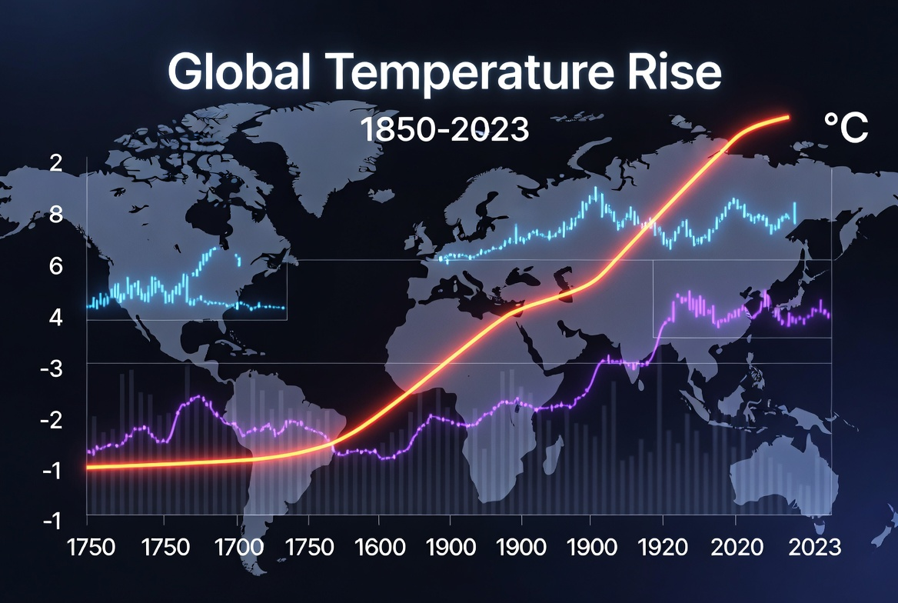

# <center> **PROJECT: Global Temperature Analysis & Forecasting**

Time series analysis and forecasting of average monthly temperatures using historical climate data.

---

<div align="center">
  
</div>

---

### **Project Goal**

Analyze long-term temperature trends for a selected country and build forecasting models to predict future monthly temperatures.

---

### **Dataset**

- **Source**: Berkeley Earth Surface Temperature Study
- **File**: `GlobalLandTemperaturesByCountry.csv`
- **Period**: 1750 – present

---

### **Models & Results**

| Model              | RMSE      | MAE     | MAPE      |
|--------------------|-----------|---------|-----------|
| **Linear Regression** | **1.171** | **0.885** | **64.30%** |

---

### **Project Stages**

1. Data loading and preprocessing
2. Exploratory analysis and visualization of temperature trends
3. Holdout split (80/20)
4. Rolling window validation
5. Feature Engineering (lags, rolling statistics, calendar features)
6. Modeling (Linear Regression, XGBoost, etc.)
7. Evaluation using MAE, RMSE, and MAPE

---

### **Technologies Used**

- `pandas`, `numpy`
- `scikit-learn`
- `matplotlib`, `seaborn`, `plotly`

---

### **Project Structure**

- `notebooks/` — main Jupyter notebook
- `data/` — raw dataset
- `figures/` — visualizations and forecast plots
- `requirements.txt`

---

### **Conclusion**

This project demonstrates practical skills in time series analysis and forecasting using real climate data. Through proper validation techniques and feature engineering, a baseline Linear Regression model was built to predict future monthly temperatures.

---

### **How to run**

```bash
cd Time-Series.Global-Temperature-Analysis

pip install -r requirements.txt

jupyter notebook "PROJECT - Time Series. Global Temperature Analysis and Forecasting.ipynb"